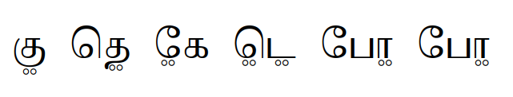
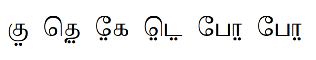
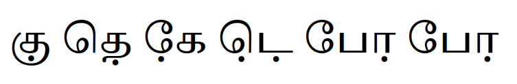

# Tamil nukta

## Encoding

The Tamil language ([tam](https://www.ethnologue.com/language/tam/))
is written in the Tamil script ([Taml](https://scriptsource.org/scr/Taml))
which Unicode encodes in the [Tamil block](https://www.unicode.org/charts/PDF/U0B80.pdf).
Some languages written in Tamil script such as
Irula ([iru](https://www.ethnologue.com/language/iru/)) and
Badaga ([bfq](https://www.ethnologue.com/language/bfq/))
require a [nukta](https://www.unicode.org/versions/Unicode16.0.0/core-spec/chapter-12/#G706808).
There are two different nuktas
- U+1133B COMBINING BINDU BELOW
- U+1133C GRANTHA SIGN NUKTA

from the [Grantha block](https://www.unicode.org/charts/PDF/U11300.pdf).
Support for the two nukta characters varies between applications, so both codepoints should be tested.
The text (both below and in a [file](data.txt)) is the same on each line except for the different nukta codepoints.
```
U+1133B:  க𑌻ு த𑌻ெ கே𑌻 ட𑌻ெ𑌻 போ𑌻 போ𑌻
U+1133C:  க𑌼ு த𑌼ெ கே𑌼 ட𑌼ெ𑌼 போ𑌼 போ𑌼
```

## Test Data

### Short Tests

| Text  | USVs      | Font        | Settings | Result                      |
| ----- | --------- | ----------- | -------- | --------------------------- |
| க𑌻ு    | 0B95 1133B 0BC1 | ThiruValluvar |   |  |
| க𑌼ு    | 0B95 1133C 0BC1 | ThiruValluvar | lang=iru   |  |
| த𑌻ெ    | 0BA4 1133B 0BC6 | ThiruValluvar |   |  |
| ...   |                 |               |   |                                                 |
| போ𑌼   | 0BAA 0BC7 0BBE 1133C | | ThiruValluvar | cv01=2 |  |

### Long tests

| Text  | USVs          | Font        | Settings | Result                      |
| ----- | ------------- | ----------- | -------- | --------------------------- |
| க𑌻ு த𑌻ெ கே𑌻 ட𑌻ெ𑌻 போ𑌻 போ𑌻 | 0B95 1133B 0BC1 0BA4 1133B 0BC6 0B95 0BC7 1133B 0B9F 1133B 0BC6 1133B 0BAA 0BCB 1133B 0BAA 0BC7 0BBE 1133B | Thiruvalluvar |    |  |
| க𑌼ு த𑌼ெ கே𑌼 ட𑌼ெ𑌼 போ𑌼 போ𑌼 | 0B95 1133C 0BC1 0BA4 1133C 0BC6 0B95 0BC7 1133C 0B9F 1133C 0BC6 1133C 0BAA 0BCB 1133C 0BAA 0BC7 0BBE 1133C | Thiruvalluvar |    |  |
 


Codepoints are

- U+1133B
```
0B95 1133B 0BC1
0BA4 1133B 0BC6
0B95 0BC7 1133B
0B9F 1133B 0BC6 1133B
0BAA 0BCB 1133B
0BAA 0BC7 0BBE 1133B
```
- U+1133C
```
0B95 1133C 0BC1
0BA4 1133C 0BC6
0B95 0BC7 1133C
0B9F 1133C 0BC6 1133C
0BAA 0BCB 1133C
0BAA 0BC7 0BBE 1133C
```

## Different forms of nuktas

Not only are there two different nukta codepoints,
but different languages prefer different visual forms.

By default the nuktas in the ThiruValluvar font
([GitHub releases](https://github.com/nlci/taml-font-thiruvalluvar/releases)) or
([Language Font Finder](https://lff.api.languagetechnology.org/family/thiruvalluvar))
are the single ring.


Irula is written with a double ring nukta.
This form can be enabled by setting the language of the text to `iru`.


Irula used to be written with a double dot nukta.
This form can be enabled by setting the font feature `cv01` to `1`.



Badaga is written with a single dot nukta.
This form can be enabled by setting the font feature `cv01` to `2`.


Another font, [Tiro Tamil](https://fonts.google.com/?query=Tiro+Tamil) (on Google Fonts), can be used to show the single dot nukta. This font does not support U+1133C, so only the text with U+1133B should be tested with this font.


